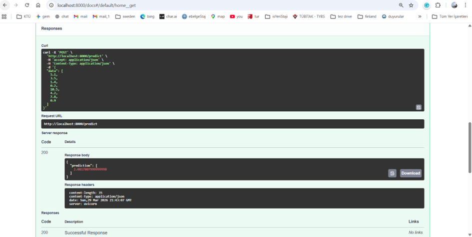

# 🚀 End-to-End MLOps Pipeline: House Price Prediction

This project is a comprehensive **MLOps** workflow covering everything from training a machine learning model to serving it using modern software architectures like **FastAPI**, **Docker**, and **Kubernetes**.

## 🎯 Project Objective
The goal is to demonstrate how a house price prediction model can be transitioned from a simple notebook into a scalable, production-ready microservice architecture.

---

## 🏗 Architecture & Workflow

The project is built on four main pillars:

1. **Model Training (`src/`):** A regression model was trained using Scikit-learn, with performance metrics analyzed and validated.
2. **API Layer (`api/`):** The trained model was wrapped into a web service using the high-performance **FastAPI** framework.
3. **Containerization (`Dockerfile`):** The application and its dependencies were packaged into a **Docker** image.
4. **Orchestration (`k8s/`):** The Docker image was deployed on **Kubernetes** using Deployment and Service objects for scalability.

---

## 🛠 Tech Stack

*   **Language:** Python 3.9+
*   **ML:** Scikit-learn, Pandas, Joblib
*   **API:** FastAPI, Uvicorn
*   **DevOps:** Docker, Kubernetes (K8s)
*   **Model Management:** Git LFS (Large File Storage)

---

## 🚀 How to Run

### 1. Local Environment
```bash
# Install dependencies
pip install -r requirements.txt

# Start the API
uvicorn api.app:app --reload
```
To access the API interface (Swagger UI): `http://localhost:8000/docs`

 

### 2. Using Docker
```bash
# Build the image
docker build -t mlops-house-app .

# Run the container
docker run -p 8000:8000 mlops-house-app
```

### 3. On Kubernetes
```bash
# Apply K8s configurations
kubectl apply -f k8s/

# Check service status
kubectl get services
```

---

## 📦 Model Management (Git LFS)

The `.pkl` model file used in this project exceeds GitHub's size limits, therefore it is managed using **Git LFS (Large File Storage)**. Please ensure Git LFS is installed on your system when cloning this repository to ensure the model file is downloaded correctly.

---

## ✒️ Author

**Nisa Beyza Nar** - [Connect on LinkedIn](https://www.linkedin.com/in/nisabeyzanar/)